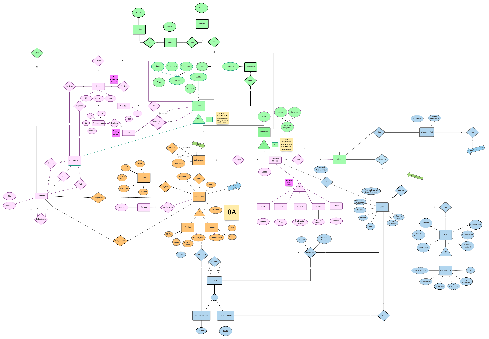

# Universidad de Costa Rica

# Documento de conceptualización

# EMPRENDE@UCR

# Version 2.0

[Referencia al control de versiones actual para el documento y el sistema](https://bitbucket.org/cristian_quesadalopez/ecci_ci0128_i2021_g01_pi/src/master/)

**Tabla de contenidos**

1. Definiciones, acrónimos y abreviaciones
2. Introducción
3. Listado de equipos y miembros
    - Roles de iteración
4. Descripción general del sistema a desarrollar
    - Contexto y situación actual
    -  Problema que resuelve
    -  Interesados del proyecto y tipos de usuarios
    -  Solución propuesta
    - Análisis del entorno
    - Visión del producto
    - Relación con otros sistemas externos
    - Descripción de los módulos y epics
    - Requerimientos Funcionales
    - Product Road Map
    - Requerimientos no funcionales
5. Artefactos de bases de datos
    - Requerimiento de datos
    - Esquema conceptual
    - Esquema lógico
6. Decisiones técnicas
    - Metodologías utilizadas
    - Artefactos utilizadas en el desarrollo
    - Tecnologías utilizadas
    - Repositorio de código & estrategia git
    - Definición de listo
7. Bitácoras
8. Referencias bibliográficas

## Definiciones, acrónimos y abreviaciones

## Introducción

## Listado de equipos y miembros

### Roles de iteración

#### 3DKR:
    Rafael Porras       ->  Documentación
    Kevin Salas         ->  Look and feel
    Daniel Mayorga      ->  Scrum ambassador
    Dario Matamoros     ->  Bases de Datos
    Donaldo Salas       ->  Scrum master
    Andrés Chaves       ->  Estrategias Git

#### Phoenix:
    Alejandro Ramirez   ->  Documentación
    Luis Ureña          ->  Look and Feel
    Andres Zamora       ->  Scrum Master
    Hellen Fuentes      ->  Scrum ambassador
    Erick  Murillo      ->  Base de Datos
    Jean Carlo Quesada  ->  Estrategias Git

#### Pandemic:
    Manfred Carvajal    ->   Documentación
    Diego Barquero      ->   Look and feel
    Luis Rojas          ->   Scrum ambassador
    Jostyn Delgado      ->   Bases de Datos
    Isaac Herrera       ->   Scrum master/Documentación
    Johel Phillips      ->   Estrategias Git

#### F & ½L:
    Juan Valverde       ->   Scrum Master
    Herson Mena         ->   Bases de Datos
    Hansel Calderon     ->   Look and feel
    Sebastian Chavez    ->   Estrategias Git
    Silvia Aguilar      ->   Scrum Ambassador
    Eddy Ruiz           ->   Documentación

## Descripción general del sistema a desarrollar

### Contexto y situación actual

Debido a la pandemia por el coronavirus, existen muchas personas que se han quedado sin trabajo o no han podido hacer ventas de sus negocios. Por este motivo se decidió realizar una página web que permita a cualquier emprendedor promocionar y vender su producto o servicio.

### Problema que resuelve

Le permite a los emprendedores de cualquier tamaño dar a conocer sus productos y servicios permitiendo un canal comunicación entre el cliente y el emprendedor.

### Interesados del proyecto y tipos de usuarios

Los interesados del proyecto son los emprendedores que deseen vender su producto/servicio por medio de la página, así como los clientes que estén interesados en algún producto o servicio.

#### Tipos de Usuario:

*Emprendedor:* Perfil de la persona/empresa que vende servicios o productos.

*Cliente:* Perfil de la persona que desea comprar algún servicio o producto.

*Administrador:* El encargado de administrar la página web.

### Solución propuesta

La solución propuesta es realizar una página web que permita tanto promocionar productos o servicios como realizar las compras dentro de la página. Además la página contará con un canal de comunicación directo(chat) entre cliente y emprendedor que permitirá que ambas partes se pongan de acuerdo en la orden y entrega del pedido/servicio. La app también permitirá crear alianzas entre emprendedores.

### Análisis del entorno

### Visión del producto

Para los emprendedores nacionales, quienes necesitan un medio para promocionar y vender sus productos y/o servicios, EMPRENDE@UCR es una plataforma web que permite la venta y compra en línea de productos y servicios. A diferencia de otras plataformas no enfocadas en los pequeños emprendedores, nuestro producto, además de ser gratuito, busca el crecimiento de los pequeños emprendedores y fomenta la cooperación entre estos.

### Relación con otros sistemas externos

Los módulos del sistema web tiene relación con otros sistemas que ya existan.
ejemplo: la parte de los pagos, preguntar a la po si visualiza otros sistemas que quiera integrarle (facturas)

### Descripción de los módulos y epics

Los módulos que fueron asignados a cada equipo son los siguientes: 

- **3DKR:** módulo de emprendedores
- **Pandemic:** módulo de usuarios y perfiles
- **F&½L:** módulo de gestión de pedidos y compras
- **Phoenix:** módulo de administración

#### Descripción de los módulos:

- **Emprendedores:** 

Consiste en todas las funcionalidades que puede realizar un emprendedor, principalmente registrar productos y servicios y formar alianzas con otros emprendedores 

- **Usuarios y perfiles:** 

Consiste en todo el proceso de creación y registro de un perfil ya sea de emprendedor o comprador, la autenticación de la cuenta y la autorización de las funcionalidades que tiene permitido realizar

- **Gestión de pedidos y compras:** 

Consiste en todo el proceso de compra de un producto o servicio, entre estos está el proceso de pago, seguimiento del producto, proceso de checkout y finalización de órdenes  

- **Administración:** 

Consiste en todo lo relacionado a administración, esto incluye la categorización y etiqueta de los diferentes productos y servicios disponibles además del chat entre los usuarios de la página 

#### Descripción de los epics:

- **Gestión de productos:** 

Poder agregar un producto o servicio para poder venderlo.

- **Registro de usuarios:** 

Poder crear y registrar una cuenta con perfil de emprendedor o comprador.

- **Pedidos en carrito de compras:**

Poder incluir en un carrito de compras una serie de productos o servicios (pero no ambos) de un mismo emprendedor y poder concluir esa compra con su respectivo pago.

- **Categorización de productos:** 

Poder categorizar y etiquetar productos o servicios.

#### Relación con los demás módulos: 

- **Relación módulo usuario y perfiles con módulo emprendedores**
    - Se relacionan directamente ya que es necesario que exista un usuario con perfil de emprendedor para poder realizar las funciones exclusivas de un emprendedor.

- **Relación módulo usuario y perfiles con módulo gestión de pedidos y compras**
    - Se relacionan directamente ya que es necesario que exista un usuario con perfil de comprador para poder realizar las compras de los productos o servicios de emprendedores.

- **Relación módulo usuario y perfiles con módulo administración**
    - Se relacionan directamente ya que el módulo de administración cumple con la funcionalidad de realizar reportes a los usuarios además de los métodos de pago de los usuarios y el chat entre usuario emprendedor y usuario comprador.

- **Relación módulo emprendedores con módulo gestión de pedidos y compras**
    - Se relacionan ya que los productos o servicios que los emprendedores suban a la página, el proceso de venta y pedidos de estos productos va a ser manejado por el módulo de pedidos y compras.

- **Relación módulo gestión de pedidos y compras con módulo administración**
    - El módulo de administración tiene la funcionalidad de los métodos de pago, por esto tiene relación directa con el modulo de gestion de pedidos y compras ya que es necesario conocer y poder realizar el pago del servicio o producto.

- **Relación módulo emprendedores con módulo administración**
    - Similar al punto anterior existe una relación directa entre estos módulos ya que se debe de tener conocimiento de cuáles son los métodos de pago que si son aceptados para un emprendedor en particular.

### Requerimientos Funcionales

El proyecto es organizado usando una herramienta en línea llamada JIRA Software. En JIRA, seguimos la siguiente estructura:

- Cada característica que el dueño del producto requiera en nuestra solución es llamada **historia de usuario**, la cual es generada por los desarrolladores a partir de las indicaciones del dueño del producto. Si cumplir una historia implica varias actividades para los desarrolladores, entonces la historia es conocida como **epic**. Los epics están compuestos en sí mismos por historias de usuario. En JIRA, otorgamos a cada epic su propio código identificador, y a cada historia la vinculamos con el epic del que se origina.

- Los desarrolladores estimamos cuánto esfuerzo y tiempo puede tomarnos cumplir con una historia por medio de la asignación de puntos de historia, la cual definimos por medio de sesiones de votación en las que debemos llegar a un consenso.

- Para saber cuándo una historia de usuario está cumplida, declaramos definiciones de listo (**Definitions of Done**) y **Criterios de aceptación**:
    
    1. Los *Criterios de aceptación* son las características que el cliente requiere que se incluyan en la solución cuando la historia a la que pertenece se considere terminada. Estos criterios son definidos por el dueño del producto y suele ser definido un sólo grupo de criterios para cada historia por aparte.

    2. Las *Definitions of done* son las características técnicas definidas por los desarrolladores de lo que debe cumplirse en la implementación de la historia para darla por hecha. Las definitions of done son definidas para ser cumplidas en todas las historias.

- Para priorizar las historias, contamos con la pila del producto, también conocida como **Backlog**. El Backlog consiste en una estructura en la cual hay historias que se apilan sobre otras en orden de prioridad. Cuanto más cerca esté una historia del tope, más prioridad habrá que darle. Por ejemplo, la historia que se encuentre en el tope de la pila es la más apremiante, es decir, aquella que los desarrolladores deberían implementar primero. Cuando tal historia es dada por hecha, es retirada del backlog y la posición del tope es ocupada por la historia que es encontraba justo debajo de la misma en el backlog. Es importante destacar que el dueño del producto es el único con autoridad para ajustar las prioridades de cada historia que esté incluida en el backlog.

- Para mejorar la organización entre equipos, JIRA nos permite crear **Boards**. Hay un total de 4 boards para el proyecto, uno para cada equipo. Cada board muestra las historias aportadas por los miembros de un equipo en específico.  

#### Referencia al proyecto de JIRA

Para poder acceder al [proyecto](http://10.1.4.22:8080/secure/RapidBoard.jspa?projectKey=PIIB12021&useStoredSettings=true&rapidView=43) el usuario necesita de acceso a un VPN para conectarse, así como acceso a un usuario y una contraseña.

### Product Road Map
#### 3DKR:
    **Sprint #0:**    ->   Product Management                   -Fill/Add information to product
                                                                -Add a new category to the product

    **Sprint #1:**    ->   Product Management                   -Add products workflow
                      ->   Service Management                   -Product Services

    **Sprint #2:**    ->   Offer Management                     -CRUD for Offers
                      ->   Ranking Management                   -Entrepreneur Rating for clients
                      ->   Entrepreneurs Alliances              -Alliances between Entrepreneurs

    **Sprint #3:**    ->   Profile Management
                      ->   Entrepreneurs Alliances

#### Phoenix:
    **Sprint #0:**    ->   Categorization System                -Create/Delete/Edit Category

    **Sprint #1:**    ->   Recommendation System                
                      ->   Payment Methods                      -Enable/Desable Payment Methods

                      ->   Categorization System                -Edit/View Categories
                      
                      ->   Reportation System                   -View Reports
                                                                -Make Reports

    **Sprint #2:**    ->   Payment Method                       -Update Payment Method interface

                      ->   Payment Info                         -Add/Delete/View Entrepreneur payment info

                      ->   Chat System                          -View chat messages

                      ->   Categorization System                -Category user stories correction

    **Sprint #3:**    ->   Chat System                          -View/Send chat messages

#### Pandemic:
    **Sprint #0:**    ->   User Register                        -Client page
                                                                -Entrepreneur page
                                                                -Administrator page
                                                                -Data security
                                                                -Main products management

    **Sprint #1:**    ->   User Register                        -User Register
                                                                -User login

                      ->   User Pages                           -Product search
                                                                -Homepage
                                                                -Profile editing

    **Sprint #2:**    ->   Client-Category Management           -Favorite categories of client and entrepreneur

                      ->   Score System                         -Offer and product view
                                                                -Feedback messages in real time

                      ->   User usability                       -Administrator application
                                                                -Password restoration

    **Sprint #3:**    ->   Score System

#### F & ½L:
    **Sprint #0:**    ->   Clients Products Requests            -Shopping cart
                                                                -Order options and requirements

    **Sprint #1:**    ->   Com. between Customer-Entrepreneur   -Basic functionality for buying products/services
                                                                -Functionality for selling products/services
    
    **Sprint #2:**    ->   Products Request Management          -Communication with the client
                      ->   Update of Order Status               -Status assignation

    **Sprint #3:**    ->   Notif. of req. and their statuses

### Requerimientos no funcionales

#### Eficiencia
- Toda funcionalidad del sistema debe responder al usuario en menos de 5 segundos
- Los datos modificados en la base de datos se deben ver reflejados en tiempo real para todos los usuarios.
- El sistema debe soportar una concurrencia de al menos X usuarios. (Validar con P.O)

#### Seguridad
- Los permisos del sistema solo pueden ser cambiados por un administrador.
- Se debe asegurar la privacidad de los datos sensibles del usuario.

#### Usabilidad
- El tiempo de aprendizaje del sistema por un usuario deberá ser menor a X tiempo. (Validar con el asesor)
- El sistema debe contar con un manual de usuario.
- El sistema debe proporcionar mensajes de error útiles para el usuario.
- La aplicación web debe garantizar la adecuada visualización en múltiples dispositivos (computadoras, teléfonos, tabletas, ...).
- El sistema debe poseer interfaces gráficas limpias e intuitivas.

#### Disponibilidad
- El sistema debe estar disponible el 99.981% del tiempo.

## Artefactos de bases de datos

### Requerimiento de Datos
Un Producto_Servicio tiene una descripción, ID que lo identifica como único, también debe tener una disponibilidad. Un Producto_Servicio puede ser un Producto ó un Servicio.
En donde se tiene que un Producto tiene una o más fotos, posee un precio y un nombre.

Existe un Carrito que es poseído por cada cliente, en donde un carrito es único para cada cliente, este carrito puede tener productos y servicios. Un carrito tiene como atributos derivados un precio total y una cantidad de productos.

Se agregan 3 nuevos atributos a la tabla Order: 
"Date and hour of State Changed": Esto para llevar un control sobre las notificaciones, para así saber cuando una notificación nueva debe de aparecer.
"View": Para saber cuando la notificación de una orden respectiva ha sido vista o no.
"State": Esta es una llave foránea de la tabla "Generic_Status", para controlar cual es el estado actual de la orden, y poder cambiarlo cuando sea necesario. Esto es parte de la nueva relación "Has" entre la tabla "Order" y "Generic_Status".

También se agrego una nueva relación N:M, llamada "Has_Status", entre la tabla "Product_Service" y la tabla "Personalized_status", esto para relacionar a los productos y servicios con sus respectivos estados personalizados, creados por el emprendedor. Esta nueva relación crea una nueva tabla que contiene las llaves de las tablas con las cuales se relaciona como llaves foráneas, y un atributo extra llamado "Order" para indicar el orden en el cual los estados personalizados, de los productos y servicios respectivos, deben de aparecer.

Por ultimo se crearon dos nuevas vistas llamadas "OrderNotificationEntrepeneurs" y "OrderNotificationClient", estas fueron creadas para manejar las notificaciones de los emprendedores y clientes respectivos. 
En el caso de la vista "OrderNotificationEntrepeneurs" esta contiene los atributos "Client_Email", "Date_and_hour_of_creation", "State", "Entrepreneur_Email", "Name" y "Date_and_hour_of_State_Changed", la vista solo contiene los atributos de las ordenes que tienen como estado actual "Pendiente de revision", esto para notificarle al emprendedor, de tales ordenes, que nuevas ordenes han sido creadas y que deben de revisarse. 
Ahora, la otra vista llamada "OrderNotificationClient" contiene los atributos "Client_Email", "Date_and_hour_of_creation", "State", "Name", "Date_and_hour_of_State_Changed" y "view",  la vista solo contiene los atributos de las ordenes que tienen como estado actual "Rechazado" o "Aceptado" y que además "view" sea igual a 0, esto para notificarle al cliente, de dichas ordenes, que sus ordenes, anteriormente creadas, han sido revisadas y que están en un nuevo estado, "Rechazado" o "Aceptado".

### Esquema conceptual

Referencia al archivo fuente: [Esquema conceptual de la base de datos](https://lucid.app/lucidchart/521c91fc-fdbb-42cb-8564-09c0ab52c460/edit?page=0_0#)

### Esquema lógico

Referencia al archivo fuente: [Esquema lógico de la base de datos](https://lucid.app/lucidchart/521c91fc-fdbb-42cb-8564-09c0ab52c460/edit?page=eAhCgoWCmbE2#)

## Decisiones técnicas

### Metodologías utilizadas

#### Scrum:
- **Sprints de tres semanas:** 4 (excepto el primer sprint que es de seis semanas).
    - Sprint es el nombre con el que conocemos a los ciclos de desarrollo en metodología SCRUM. 
    - Al final de cada sprint, entregamos nuevas funcionalidades al producto y recibimos retroalimentación del  PO (product owner).
- **Daily Meetings por semana:**  2.
    - Por su traducción al español, un daily meeting son reuniones diarias que se hacen en un equipo SCRUM, en las cada miembro del equipo explica sus avances, lo que se disponen a hacer y qué impedimentos puede llegar a tener para cumplir lo que tiene propuesto
- **reunión de Revisión:** Realizado al final de cada sprint y junto a los stakeholders.
    - Esta reunión ocurre al final de cada sprint. Aquí se presenta al PO y a los stakeholders los avances de la iteración recién acabada. 
    - El equipo recibe del PO y stakeholder retroalimentación que deberá ser tomada en cuenta para la siguiente iteración.
- **reunión de Sprint Retrospective:** Realizado al final de cada sprint y entre el equipo de trabajo.
    - En esta reunión, los equipos SCRUM reflexionan sobre lo bueno, malo y mejorable del sprint, y proponen acciones que puedan ayudar a mejorar resultados en el siguiente sprint. 
- **reunión de Planning:** Realizado  antes de empezar cada sprint.
    - En el sprint planning, se realiza la planeación del sprint nuevo. 
    - Con la ayuda del PO, los equipos forman sus backlogs de historias por trabajar en el sprint nuevo.

#### Principio SOLID:
- **S-Single Responsibility Principle**
    - Responsabilidad única: Cada componente del software sólo tiene una responsabilidad y con ello, sólo una razón para ser modificado.
- **O-Open/Closed Principle**
    - Abierto/Cerrado: El código es cerrado a modificaciones, pero abierto a ser expandido.
- **L-Liskov Substitution Principle**
    - Sustitución de Liskov: En relaciones de herencia, sustituir al padre por cualquiera de sus hijos no afectará al programa.
- **I-Interface Segregation Principle**
    - Segregación de interfaces: No se debe forzar a las clases del producto a recibir interfaces que no va a necesitar.
- **D-Dependency Inversion Principle**
    - Inversión de dependencia: Las clases deben depender en abstracciones y no de otras clases concretas.
#### Otras:
- **Pair programming**
    - Se define una pareja de programadores, cada una con un driver y un navigator, así como un tiempo de rotación.
    - El driver escribe el código y el navigator observa la pantalla en todo momento para apoyar al driver en lógica y sintáxis.
    - Cuando se cumple el tiempo definido inicialmente, los programadores intercambian roles.
    - Este proceso puede ser llevado por cualesquiera 2 personas de un equipo.
- **Clean architecture**
- **Refactoring**
    - Consiste en rehacer una parte de código. En este caso el refactoring consiste en reestructurar el codigo fuente para migrarlo a la arquitectura DDD(Domain, Driven Design), en una separación de cuatro capas (Domain, Infrastructure, Application, Presentation).
    - El proceso de refactoring lo lleva a cabo cada equipo de trabajo para migrar su codigo a la arquitectura DDD.
- **Integración continua**
    - Una práctica de XP, extreme programming.
    - En integración continua, las integraciones de avances al producto se realizan constantmente y con commits pequeños.
    - Lo anterior para reducir la cantidad potencial de conflictos.
    - La integración continua se realiza para el branch de un mismo equipo, en el que los programadores luego de desarrollar cierta funcionalidad integran con el branch del equipo. También se debe realizar para los branches entre equipos, en este caso conocido como develop.
- **Definition of done**
    - Son criterios que  indican cuándo una historia puede ser considerada hecha.
    - Son definidos por los equipos de desarrollo y aplican a cada historia.
    - Permiten una estandarizacion de que es lo mínimo que debe tener cada historia para considerarse terminada.

### Artefactos utilizadas en el desarrollo

**Product Backlog:**

Durante el sprint 0, se asignaron módulos a cada equipo de desarrolladores y a partir de los requerimientos de la P.O, se asignaron EPICS y historias de usuario para cada equipo.

**Sprint Backlog:**

Según las tareas prioritarias del backlog, se realizó un product roadmap en el cuál seleccionaron historias de usuario.

### Tecnologías utilizadas

#### Tecnologías de desarrollo

- **Blazor (Versión 5.0):** Framework enfocado en el desarrollo de aplicaciones web incorporado en .NET. Utiliza los lenguajes C# y HTML. 
- **ASP.NET (Versión 5.0):** Framework para el desarrollo de aplicaciones web.

#### Bases de datos

- **SQL Server 2016:** Lenguaje de bases de datos relacionales.
- **Microsoft SQL Server Management Studio 18:** Administrador de componentes dentro de SQL Server.

#### Administración

- **Bitbucket:** Sistema de alojamiento de proyectos que utiliza el sistema de control de versiones git.
- **Git:** Software de control de versiones (v2.31.1).
- **Jira:** Herramienta de administración de proyectos (v7.13.0).

#### Ambiente de desarrollo

- **Visual Studio:** Entorno de desarrollo integrado (IDE) (v16.9).

### Repositorio de código & estrategia git

#### Branches

- *Main*

- *Develop*

- *Team*

- *Feature*

De Feature a Team. PR, code review por una persona del team.

De Team a Develop. PR, review por 2 miembros de otros teams.

De Develop a Main. PR, review por los scrum ambassadors.

**DEVELOP -> MAIN**

- Asegurarse que main esta actualizado. Pull main.

- Asegurarse que develop esta actualizado. Merge main into develop.

- Corregir conflictos si los hay.

- Crear PR de DEVELOP into MAIN. Esperar aprobacion de los otros equipos (scrum ambassadors).

**TEAM -> DEVELOP**

- Hacer CHECKOUT a branch DEVELOP.

- Hacer PULL de cambios a branch DEVELOP y conciliar conflictos.

- Hacer CHECKOUT a branch TEAM.

- Mergear DEVELOP into TEAM y conciliar conflictos.

- Crear PR de TEAM into DEVELOP.

- Esperar aprobacion de 2 miembros de otros equipos.

### Definición de listo

La definición de listo (DOD) abarca los siguientes aspectos:

- **Arquitectura:**
    - Obedecer los principios SOLID.

- **Producto:**
    - El código debe cumplir los sigiuentes principios:
        - YAGNI
        - KISS
        - DRY

    - El código debe aprobar el las siguientes reglas de estilos basadas en el linter de [Google.](https://google.github.io/styleguide/csharp-style.html) **siempre y cuando aplicarlas no afecte el rendimiento ni compilación del sitio**. Las reglas son:
        - Las líneas no deben superar más de 80 carácteres.
        - Cada archivo debe terminar con una línea en blanco.
        - Debe de haber un espacio en blanco entre carácteres ',',':','{','}','(' y el resto de la línea donde se encuentren.
        - Usar espacios en blanco en lugar de tabuladores.
        - Al añadir comentarios al código, dejar un espacio en blanco entre inicio del mismo y el comentario en sí. (Ejemplo: // Este es un comentario)
        - Resumen de archivo en forma de comentario al comienzo de cada archivo
            Plantilla en cada método:

            /*

            Resumen:

            Recibe:

            Retorna:

            Posibles excepciones:

            */
        - Modularizar estilos: Siempre que sea posible, no implementar estilos en archivos razor. Separarlo en .css aparte.

- **Repositorio:**
    - Verificar la funcionalidad antes de fusionar una funcionalidad con el master.

- **Validación de historias con PO:**
    - Las historias deben de ser aceptadas por el equipo y el PO, antes de llevarse a un sprint.
    - Las historias de usuarios deben ser INVEST.

- **Intragrupal:**
    - Cualquier funcionalidad que se agregue no debe afectar a los demás equipos.
    - Comprobar las funcionalidades complementarias entre los grupos.

## Bitácoras
- [Daily Meeting Report.](https://docs.google.com/spreadsheets/d/1vboRJwl7TfQBPofRB58tHBFxUC7Q7FTaEbG2q-Etz1M/edit#gid=1481241924)
- [Retrospective Report.](https://docs.google.com/spreadsheets/d/1vboRJwl7TfQBPofRB58tHBFxUC7Q7FTaEbG2q-Etz1M/edit#gid=203688471)
- [Sprint Review Report.](https://docs.google.com/spreadsheets/d/1vboRJwl7TfQBPofRB58tHBFxUC7Q7FTaEbG2q-Etz1M/edit#gid=849688878)
## Referencias bibliográficas

1. Atlassian. (n.d.-a). *Agile roadmaps: build, share, use, evolve*. <https://www.atlassian.com/agile/product-management/roadmaps>

2. Atlassian. (n.d.-b). *Epics*. <https://www.atlassian.com/agile/project-management/epics>

3. Atlassian. (n.d.-c). *Git Feature Branch Workflow | Atlassian Git Tutorial*. <https://www.atlassian.com/git/tutorials/comparing-workflows/feature-branch-workflow>

4. Atlassian. (n.d.-d). *Gitflow Workflow | Atlassian Git Tutorial*. <https://www.atlassian.com/git/tutorials/comparing-workflows/gitflow-workflow>

5. Atlassian. (n.d.-e). *Product Backlog Grooming*. <https://www.atlassian.com/agile/scrum/backlogs>

6. Atlassian. (n.d.-f). *Pull Requests | Atlassian Git Tutorial*. <https://www.atlassian.com/git/tutorials/making-a-pull-request>

7. Atlassian. (n.d.-g). *User Stories | Examples and Template*. <https://www.atlassian.com/agile/project-management/user-stories>

8. Atlassian. (n.d.-h). *What is Scrum?* <https://www.atlassian.com/agile/scrum>

9. Atlassian. (n.d.-i). *What is version control | Atlassian Git Tutorial*. <https://www.atlassian.com/git/tutorials/what-is-version-control>

10. Cohn, M. (2005). *Agile Estimating and Planning* (1st ed.). Pearson.

11. Microsoft. (n.d.-a). *Microsoft SQL documentation* - SQL Server. Microsoft Docs. <https://docs.microsoft.com/en-us/sql/?view=sql-server-ver15>

12. Microsoft. (n.d.-b). *Visual Studio documentation*. Microsoft Docs. <https://docs.microsoft.com/en-us/visualstudio/windows/?view=vs-2019&preserve-view=true>

13. *Scrum Training Series: Free Scrum Master Training from Seattle*. (n.d.). Scrum Training Series. <https://scrumtrainingseries.com/>